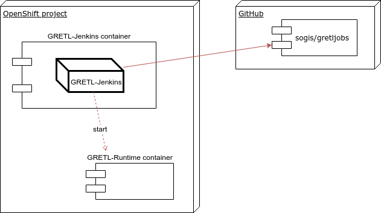

Einführung und Ziele
====================

Dieses Dokument ist nach [arc42](http://www.arc42.de/) Template Revision 7.0 strukturiert.

Diagramme werden online auf [draw.io](https://www.draw.io/) erstellt.
Die XML Definitionen der Diagramme liegen neben den exportierten Bildern.

Aufgabenstellung
----------------

### Was ist GRETL?
GRETL ist eine [Gradle](https://gradle.org/) Erweiterung zur Ausführung von GEO Daten Transformationen.

Der Name GRETL ist eine Kombination von **Gr**adle und [ETL](https://de.wikipedia.org/wiki/ETL-Prozess)

Qualitätsziele
--------------
* Standartisierter und automatisierter Build Prozess.

Randbedingungen
===============

Organisatorische Randbedingungen
--------------------------------

### Veröffentlichung als Open Source
Die Lösung wird als Open Source verfügbar gemacht.

Lizenz: MIT

Kontextabgrenzung
=================

Fachlicher Kontext
------------------

* **AGI**: erstellt Jobs im *gretljobs* Repository auf *GitHub* und verwaltet deren Ausführung über den *GRETL Jenkins*.
* **GitHub**: webbasierter Online-Dienst für das Versionsverwaltungssystem Git: <https://github.com/>
* **gretljobs**: Transformations-Job Konfigurationen für die *GRETL Runtime*.
* **GRETL**: System für die Ausführung der GRETL Jobs.
* **GRETL Jenkins**: Verwaltungsoberfläche / UI für GRETL Jobs.
* **GRETL Runtime**: Runtime für GRETL Jobs.

### GRETL-Job Generierung (Seeder-Job)
Beim GRETL-Jenkins ist ein [Seeder-Job](https://github.com/sogis/openshift-jenkins/blob/master/configuration/jobs/administration/jobs/gretl-job-generator/config.xml)
vor konfiguriert, welcher die GRETL-Jobs generiert. Der Job verwendet die [Job DSL](https://wiki.jenkins.io/display/JENKINS/Job+DSL+Plugin).

Der GRETL-Jenkins bekommt die Konfiguration vom Seeder-Job über Umgebungsvariablen:
* **GRETL_JOB_REPO_URL**: git://github.com/sogis/gretljobs.git
* **GRETL_JOB_FILE_PATH**: **
* **GRETL_JOB_FILE_NAME**: gretl-job.groovy

Dies ist die produktive Konfiguration auf das gretljobs Repo.
Über alle Ordner hinweg werden Dateien mit dem Namen *gretl-job.groovy* gesucht.
Für jede gefundene Datei/Skript wird ein Job mit der Definition aus dem Skript ([Jenkins Pipeline](https://jenkins.io/doc/book/pipeline/)) erstellt.
Der Name vom Job ist der Name vom Ordner, wo das Skript gefunden wurde.

Technischer Kontext
-------------------

### Build Pipeline
Zum Erstellen, Testen und veröffentlichen der GRETL-Runtime als Docker Image werden Jenkins Pipelines verwendet.

#### Build und Test
Dieses Skript definiert die Build Logik: **runtimeImage/pipeline/gretl-runtime-build.groovy**

Es wird ein OpenShift Projekt mit einer PostgreSQL Postgis Datenbank benötigt.
Das Setup ist im [README_BUILD.md](runtimeImage/pipeline/README_BUILD.md) beschrieben.

Stages der Pipeline:

Übersicht:

##### Build
Es wird ein Gradle Build ausgeführt, dabei werden standardmässig Unit-Tests ausgeführt.

In einem weiteren Schritt werden auch Tests gegen eine Datenbank ausgeführt.
Diese Datenbank befindet sich in einem OpenShift Projekt. Sie wird über Port-Forwarding erreichbar gemacht.

Es resultiert das getestete GRETL-Jar.

##### Integration Tests
Das gebuildete GRETL-jar wird über Gradle Build Dateien eingebunden um die Tasks zu Testen.
Es sind eigentlich GRETL-Jobs mit Test-Inhalt.

Auch hier wird die Test-Datenbank aus dem OpenShift Projekt benutzt.

##### OpenShift Build (Docker)
Wenn alle Tests grün sind, wird im OpenShift Projekt ein Build gestartet.
Dies ist ein Docker Build, wobei das GRETL-Jar mit einem base Image verheiratet wird.
Darin werden auch alle abhängenden Libraries abgelegt.

Das Docker Image wird am Schluss in der OpenShift Registry abgelegt und ist über den ImageStream vom Build Projekt verfügbar. 

### &lt;Gradle&gt;
TODO

### &lt;Jenkins&gt;
TODO

Entwurfsentscheidungen
======================

Gradle als Job Runtime
----------------------

### Fragestellung
Wieso wird Gradle als Runtime eingesetzt?

### Entscheidung
TODO

GRETL als Gradle Plugin
-----------------------

### Fragestellung
Wieso wird die ETL Logik als Gradle Plugin geschrieben?

### Entscheidung
TODO

Jenkins als Benutzeroberfläche
------------------------------

### Fragestellung
Warum ist Jenkins das UI?

### Entscheidung
TODO

GRETL Job Ausführung auf Build-Container
----------------------------------------

### Fragestellung
Wieso wird für jede Job Ausführung ein eigener Container gestartet?

### Alternativen
1. Einzelner Server läuft und steht für Jobs zur Verfügung.
2. Jeder Job hat einen laufenden Container.

### Entscheidung
Es wird das Prinzip vom Build-Container eingesetzt.
Da das Scheduling von Jenkins übernommen wird, braucht es keine lang-laufenden Container.
Zum Ausnützen der Stärken von Container Plattformen werden kurz-lebige Container eingesetzt.
Dadurch sind sie unabhängig von einander und die Resourcen können besser genutzt werden.

GRETL Runtime als Jenkins Slave
-------------------------------

### Fragestellung
Wieso ist die GRETL Runtime als Jenkins Slave realisiert?

### Alternativen
1. Einzelner Server läuft immer und arbeitet Jobs bei Aufruf ab.

### Entscheidung
TODO

Qualitätsanforderungen
======================

Qualitätsbaum
-------------

Qualitätsszenarien
------------------

Risiken und technische Schulden
===============================

Glossar
=======

| Begriff | Definition |
| --- | --- |
| *ETL* | [Extract, Transform, Load](https://de.wikipedia.org/wiki/ETL-Prozess) |
