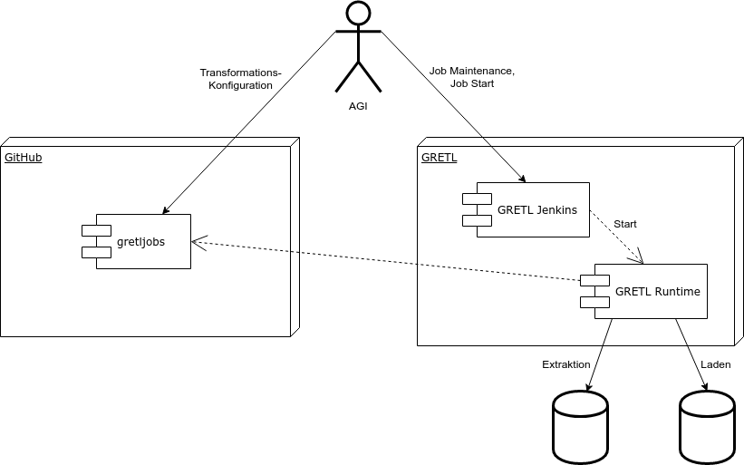

Einführung und Ziele
====================

Dieses Dokument ist nach [arc42](http://www.arc42.de/) Template Revision 7.0 strukturiert.

Diagramme werden online auf [draw.io](https://www.draw.io/) erstellt.
Die XML Definitionen der Diagramme liegen neben den exportierten Bildern.

Aufgabenstellung
----------------

### Was ist GRETL?
GRETL ist eine [Gradle](https://gradle.org/) Erweiterung zur Ausführung von GEO Daten Transformationen.

Der Name GRETL ist eine Kombination von **Gr**adle und [ETL](https://de.wikipedia.org/wiki/ETL-Prozess)

Qualitätsziele
--------------
* Standartisierter und automatisierter Build Prozess.

Randbedingungen
===============

Organisatorische Randbedingungen
--------------------------------

### Veröffentlichung als Open Source
Die Lösung wird als Open Source verfügbar gemacht.

Lizenz: MIT

Kontextabgrenzung
=================

Fachlicher Kontext
------------------

* **AGI**: erstellt Jobs im *gretljobs* Repository auf *GitHub* und verwaltet deren Ausführung über den *GRETL Jenkins*.
* **GitHub**: webbasierter Online-Dienst für das Versionsverwaltungssystem Git: <https://github.com/>
* **gretljobs**: Transformations-Job Konfigurationen für die *GRETL Runtime*.
* **GRETL**: System für die Ausführung der GRETL Jobs.
* **GRETL Jenkins**: Verwaltungsoberfläche / UI für GRETL Jobs.
* **GRETL Runtime**: Runtime für GRETL Jobs.

Technischer Kontext
-------------------

### Build Pipeline
Zum Erstellen, Testen und veröffentlichen der GRETL-Runtime als Docker Image werden Jenkins Pipelines verwendet.

#### Build und Test
Dieses Skript definiert die Build Logik: **runtimeImage/pipeline/gretl-runtime-build.groovy**

Stages der Pipeline:

Übersicht:

### &lt;Gradle&gt;
TODO

### &lt;Jenkins&gt;
TODO

Lösungsstrategie
================

Bausteinsicht
=============

Whitebox Gesamtsystem
---------------------

***&lt;Übersichtsdiagramm&gt;***

Begründung

:   *&lt;Erläuternder Text&gt;*

Enthaltene Bausteine

:   *&lt;Beschreibung der enhaltenen Bausteine (Blackboxen)&gt;*

Wichtige Schnittstellen

:   *&lt;Beschreibung wichtiger Schnittstellen&gt;*

### &lt;Name Blackbox 1&gt;

*&lt;Zweck/Verantwortung&gt;*

*&lt;Schnittstelle(n)&gt;*

*&lt;(Optional) Qualitäts-/Leistungsmerkmale&gt;*

*&lt;(Optional) Ablageort/Datei(en)&gt;*

*&lt;(Optional) Erfüllte Anforderungen&gt;*

*&lt;(optional) Offene Punkte/Probleme/Risiken&gt;*

### &lt;Name Blackbox 2&gt;

*&lt;Blackbox-Template&gt;*

### &lt;Name Blackbox n&gt;

*&lt;Blackbox-Template&gt;*

### &lt;Name Schnittstelle 1&gt;

…

### &lt;Name Schnittstelle m&gt;

Ebene 2
-------

### Whitebox *&lt;Baustein 1&gt;*

*&lt;Whitebox-Template&gt;*

### Whitebox *&lt;Baustein 2&gt;*

*&lt;Whitebox-Template&gt;*

…

### Whitebox *&lt;Baustein m&gt;*

*&lt;Whitebox-Template&gt;*

Ebene 3
-------

### Whitebox &lt;\_Baustein x.1\_&gt;

*&lt;Whitebox-Template&gt;*

### Whitebox &lt;\_Baustein x.2\_&gt;

*&lt;Whitebox-Template&gt;*

### Whitebox &lt;\_Baustein y.1\_&gt;

*&lt;Whitebox-Template&gt;*

Laufzeitsicht
=============

*&lt;Bezeichnung Laufzeitszenario 1&gt;*
----------------------------------------

-   &lt;hier Laufzeitdiagramm oder Ablaufbeschreibung einfügen&gt;

-   &lt;hier Besonderheiten bei dem Zusammenspiel der Bausteine in
    diesem Szenario erläutern&gt;

*&lt;Bezeichnung Laufzeitszenario 2&gt;*
----------------------------------------

…

*&lt;Bezeichnung Laufzeitszenario n&gt;*
----------------------------------------

…

Verteilungssicht
================

Infrastruktur Ebene 1
---------------------

***&lt;Übersichtsdiagramm&gt;***

Begründung

:   *&lt;Erläuternder Text&gt;*

Qualitäts- und/oder Leistungsmerkmale

:   *&lt;Erläuternder Text&gt;*

Zuordnung von Bausteinen zu Infrastruktur

:   *&lt;Beschreibung der Zuordnung&gt;*

Infrastruktur Ebene 2
---------------------

### *&lt;Infrastrukturelement 1&gt;*

*&lt;Diagramm + Erläuterungen&gt;*

### *&lt;Infrastrukturelement 2&gt;*

*&lt;Diagramm + Erläuterungen&gt;*

…

### *&lt;Infrastrukturelement n&gt;*

*&lt;Diagramm + Erläuterungen&gt;*

Querschnittliche Konzepte
=========================

*&lt;Konzept 1&gt;*
-------------------

*&lt;Erklärung&gt;*

*&lt;Konzept 2&gt;*
-------------------

*&lt;Erklärung&gt;*

…

*&lt;Konzept n&gt;*
-------------------

*&lt;Erklärung&gt;*

Entwurfsentscheidungen
======================

Gradle als Job Runtime
----------------------

### Fragestellung
Wieso wird Gradle als Runtime eingesetzt?

### Entscheidung
TODO

GRETL als Gradle Plugin
-----------------------

### Fragestellung
Wieso wird die ETL Logik als Gradle Plugin geschrieben?

### Entscheidung
TODO

Jenkins als Benutzeroberfläche
------------------------------

### Fragestellung
Warum ist Jenkins das UI?

### Entscheidung
TODO

GRETL Job Ausführung auf Build-Container
----------------------------------------

### Fragestellung
Wieso wird für jede Job Ausführung ein eigener Container gestartet?

### Alternativen
1. Einzelner Server läuft und steht für Jobs zur Verfügung.
2. Jeder Job hat einen laufenden Container.

### Entscheidung
Es wird das Prinzip vom Build-Container eingesetzt.
Da das Scheduling von Jenkins übernommen wird, braucht es keine lang-laufenden Container.
Zum Ausnützen der Stärken von Container Plattformen werden kurz-lebige Container eingesetzt.
Dadurch sind sie unabhängig von einander und die Resourcen können besser genutzt werden.

GRETL Runtime als Jenkins Slave
-------------------------------

### Fragestellung
Wieso ist die GRETL Runtime als Jenkins Slave realisiert?

### Alternativen
1. Einzelner Server läuft immer und arbeitet Jobs bei Aufruf ab.

### Entscheidung
TODO

Qualitätsanforderungen
======================

Qualitätsbaum
-------------

Qualitätsszenarien
------------------

Risiken und technische Schulden
===============================

Glossar
=======

| Begriff | Definition |
| --- | --- |
| *ETL* | [Extract, Transform, Load](https://de.wikipedia.org/wiki/ETL-Prozess) |
